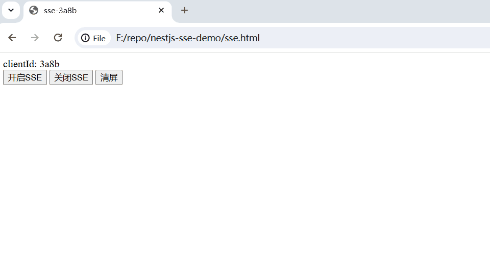
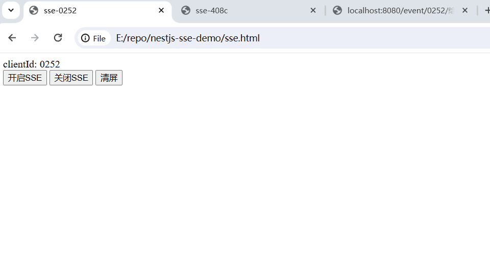
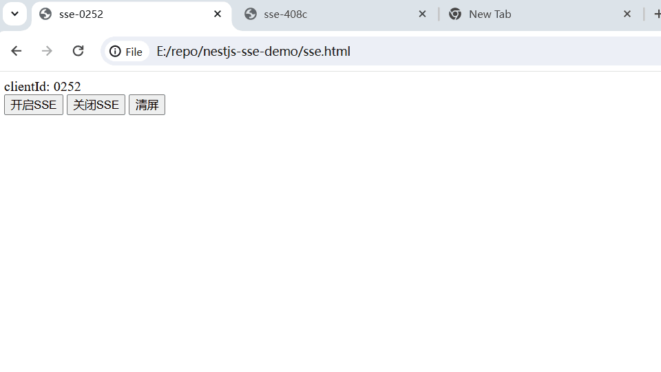

# SSE Demo

SSE Demo based on nestjs

nestjs + ioredis  
pnpm + toml config

## Get Started

1. `cfg/main.toml`为主配置入口，在指定配置中填写正确的Redis地址。  
2. 启动后端
3. CALL API向Redis阻塞队列新增1000条数据:  
   GET http://localhost:8080/redis/rpush
4. 打开前端



发送消息  


后端主动断开所有SSE连接  



## 涉及对象



**SSE Client** → sse.html  
每次刷新页面产生一个随机clientId，点击开启SSE按钮向后端发起建立SSE连接请求。    
注：以文件协议打开sse.html需要配置后端开启跨域。

**SubjectManager**  
SSE连接后端返回一个Observer流，相当于把连接抽象成了一个对象，你可以通过操作这个对象操作这个连接。  
Subject是rxjs(Reactive js)的一个类，Subject extends Observer，相当于是一个Observer流。  
通过subject.next('msg')向客户端发送消息  
通过subject.unsubscribe()服务端主动断开SSE连接

在SubjectManager中维护一个HashMap
```ts
class SubjectManager {
  public static m: Map<string, Subject<any>> = new Map<string, Subject<any>>();
}
```
key为clientId，value为Subject连接对象。  
相当于保存这些连接的引用，方便后续根据clientId取出连接，给这个连接对应客户端发送消息。

**RedisService**    
初始化Redis连接实例，一些操作Redis的基本方法。

**LongRunningService**    
长时间运行服务，作用是监听Redis的BLPOP，阻塞式读取阻塞队列中的数据。  
收到Redis的数据后，将数据通过event-emitter发布出来。

**EventListener**  
监听event-emitter发布的消息，如果是发给指定client则取出对应连接出来发送。  
如果是发给所有client则取出所有连接出来发一次。

